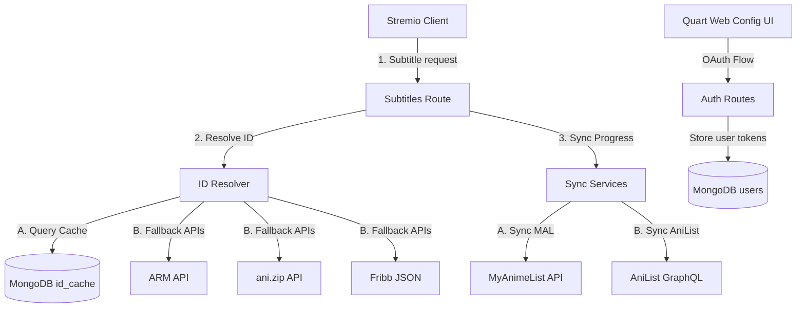

# 🌟 AniSync - MyAnimeList & AniList Tracker for Stremio

[](LICENSE)
[](https://python.org)
[](https://pgjones.gitlab.io/quart/)
[](https://www.docker.com)
[](https://stremio.com)

**AniSync** is a lightweight companion addon for Stremio. It automatically synchronizes your anime progress to **MyAnimeList** and **AniList** in real-time as you stream, and exposes your watchlists directly inside Stremio as dynamic catalogs.

---

## ✨ Core Features

### 📺 Watchlist Airing Tags (`[New]`)
AniSync checks your watchlists against AniList schedules and places a clear `[New]` tag in front of currently airing anime titles whenever a new episode has aired that you haven't watched yet.


### 🚫 Episode Filler Indicators (`[Filler]`)
Using the Jikan (MAL) API, AniSync fetches episode lists and automatically prepends a `[Filler]` tag directly to the episode titles in Stremio's player detail overlay, letting you know exactly which episodes are safe to skip.


* **Dual Account Syncing**: Connect both MyAnimeList and AniList simultaneously, keeping both watchlists updated in real-time as you play.
* **Draggable Watchlist Catalogs**: Browse your "Currently Watching", "Plan to Watch", "Completed", and other watchlist statuses as rows inside Stremio. You can toggle their visibility and drag-and-drop to reorder them on your dashboard.
* **Unified Kitsu Bridge**: Automatically maps MAL and AniList watchlists back to standard Kitsu IDs, ensuring stream providers (like Torrentio) find and serve playback links.
* **Zero-Lag Background Tracking**: Syncs progress asynchronously by listening to Stremio subtitle requests, meaning your player buffering/playback is never affected.
* **Fast Caching Engine**: Mappings and Jikan filler checks are cached in a local MongoDB instance using bulk page requests, reducing external API calls and keeping catalog loads under 100ms.
* **Web Configuration Dashboard**: An elegant settings page to link your accounts, toggle features, reorder catalogs, and monitor server diagnostics in real-time.

---

## ⚠️ Troubleshooting: Metadata Override Conflict (AnimeKitsu Addon)

If you have the **AnimeKitsu** addon installed, it might override AniSync's metadata during playback, which causes our `[Filler]` tags and custom titles to disappear in Stremio's player menu. 

Stremio resolves metadata conflicts by prioritizing whichever addon is **higher in your Stremio installed addons list**. There are two ways to fix this:

### Option A: Reorder your Addons (Highly Recommended)
1. Log in to the community-made **[Stremio Addon Manager](https://addon-manager.ad.sc.strem.io/)** using your Stremio credentials.
2. Drag **AniSync** above **AnimeKitsu** in the list to reorder them.
3. Alternatively, simply uninstall both addons, then **install AniSync first** before reinstalling AnimeKitsu. Stremio will now prioritize our metadata and display the custom tags during playback.

### Option B: Dedicated Sync-Only Mode
If you prefer to let AnimeKitsu handle all of your catalogs and search, you can turn off `"Enable Watchlist Catalogs"` and `"Enable Catalog Search"` in your AniSync dashboard. This runs AniSync silently in the background solely to synchronize your watch progress, leaving Stremio's interface clean and conflict-free.

---

## 🛠️ System Architecture



---

## 🚀 Getting Started

### Prerequisites

- [Docker & Docker Compose](https://docs.docker.com/get-docker/) installed.
- Developer accounts for:
  - **MyAnimeList** API Client (Create at [MAL API Config](https://myanimelist.net/apiconfig))
  - **AniList** API Client (Create at [AniList Developer Settings](https://anilist.co/settings/developer))

### 1. Environment Configuration

Clone this repository and create a `.env` file in the root based on `.env.example`:

```bash
cp .env.example .env
```

Fill in the necessary values:

```env
# App Settings
SECRET_KEY=generate-a-long-random-secret-string
FLASK_DEBUG=0
FLASK_RUN_HOST=yourdomain.com  # Public hostname (no protocol)

# MongoDB
MONGO_URI=mongodb://mongo:27017
MONGO_DB=anisync

# MyAnimeList OAuth Configuration
# Set the Redirect URI in MAL panel to: https://yourdomain.com/callback
MAL_CLIENT_ID=your_mal_client_id
MAL_CLIENT_SECRET=your_mal_client_secret

# AniList OAuth Configuration
# Set the Redirect URI in AniList panel to: https://yourdomain.com/anilist-callback
ANILIST_CLIENT_ID=your_anilist_client_id
```

### 2. Spinning Up Services with Docker

AniSync is ready for production out of the box with Docker Compose. Run:

```bash
docker-compose up -d --build
```

This starts:
- **Quart Web Application** on port `5000` (bridged securely to your network manager).
- **MongoDB 7** database daemon with automatic data volumes and health checks.

---

## 🧭 Setup in Stremio

1. Navigate to your deployed instance (e.g. `https://yourdomain.com`).
2. Log in using **MyAnimeList** and/or **AniList** OAuth buttons.
3. Save your preferred configurations (e.g. enabling background sync, auto-adding unlisted series).
4. Copy the generated **Manifest URL** from the dashboard.
5. In the Stremio App:
   - Go to the **Addons** tab.
   - Paste the Manifest URL into the search bar at the bottom left.
   - Click **Install** and approve.

---

## 🧪 Development & Quality Control

This project uses `uv` for dependency management. To set up local quality checks:

### Style Linting
Verify code formatting and styling standards using `ruff`:

```bash
pip install uv
uv pip install -r pyproject.toml ruff
ruff check .
```

### Code Formatting
To format imports and files automatically:

```bash
ruff format .
```

---

## 📄 License

Distributed under the MIT License. See [LICENSE](LICENSE) for more information.
