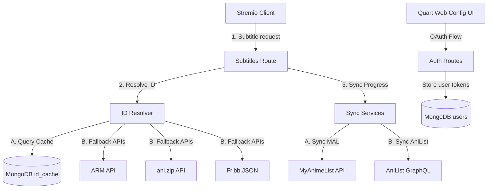

# 🌟 Anime Tracker — Stremio Sync Addon

[](LICENSE)
[](https://python.org)
[](https://pgjones.gitlab.io/quart/)
[](https://www.docker.com)
[](https://stremio.com)

**Anime Tracker** is the ultimate, asynchronous Stremio companion that automatically synchronizes your anime streaming progress to **MyAnimeList** and **AniList** in real-time. It natively bridges your tracker watchlists as browsable, interactive catalogs directly inside the Stremio interface.

---

## ✨ Features

- **Double-Platform Synchronization**: Connect *both* MyAnimeList and AniList simultaneously to update your progress on both systems.
- **Dynamic Watchlist Catalogs**: Browse your "Currently Watching", "Plan to Watch", "Completed", and "On Hold" lists directly inside Stremio's sidebar catalog menu.
- **Global Catalog Search**: Search MyAnimeList and AniList databases directly from Stremio's top search bar to play and track matches.
- **Seamless Stream Playback (MAL/AL → Kitsu Bridge)**: Leverages a multi-tiered lookup engine that maps MAL and AniList IDs back to Kitsu IDs. This ensures all stream addons (such as Torrentio or Comet) can discover and serve video streams seamlessly.
- **Background Tracking (Subtitles Interceptor)**: Listens to Stremio's subtitle resource pings upon episode playback, triggering instant updates in the background without affecting your video stream.
- **Vibrant Glassmorphic Control Panel**: A state-of-the-art web configuration dashboard with interactive switches and live diagnostic status checks.
- **Robust Cache Engine**: Integrates a MongoDB cache layer to store resolved ID mappings (Kitsu $\leftrightarrow$ MAL $\leftrightarrow$ AniList), reducing external API overhead and ensuring sub-millisecond page rendering.

---

## 🛠️ System Architecture



---

## 🚀 Getting Started

### Prerequisites

- [Docker & Docker Compose](https://docs.docker.com/get-docker/) installed.
- Developer accounts for:
  - **MyAnimeList** API Client (Create at [MAL API Config](https://myanimelist.net/apiconfig))
  - **AniList** API Client (Create at [AniList Developer Settings](https://anilist.co/settings/developer))

### 1. Environment Configuration

Clone this repository and create a `.env` file in the root based on `.env.example`:

```bash
cp .env.example .env
```

Fill in the necessary values:

```env
# App Settings
SECRET_KEY=generate-a-long-random-secret-string
FLASK_DEBUG=0
FLASK_RUN_HOST=yourdomain.com  # Public hostname (no protocol)

# MongoDB
MONGO_URI=mongodb://mongo:27017
MONGO_DB=anime_tracker

# MyAnimeList OAuth Configuration
# Set the Redirect URI in MAL panel to: https://yourdomain.com/callback
MAL_CLIENT_ID=your_mal_client_id
MAL_CLIENT_SECRET=your_mal_client_secret

# AniList OAuth Configuration
# Set the Redirect URI in AniList panel to: https://yourdomain.com/anilist-callback
ANILIST_CLIENT_ID=your_anilist_client_id
```

### 2. Spinning Up Services with Docker

Anime Tracker is ready for production out of the box with Docker Compose. Run:

```bash
docker-compose up -d --build
```

This starts:
- **Quart Web Application** on port `5000` (bridged securely to your network manager).
- **MongoDB 7** database daemon with automatic data volumes and health checks.

---

## 🧭 Setup in Stremio

1. Navigate to your deployed instance (e.g. `https://yourdomain.com`).
2. Log in using **MyAnimeList** and/or **AniList** OAuth buttons.
3. Save your preferred configurations (e.g. enabling background sync, auto-adding unlisted series).
4. Copy the generated **Manifest URL** from the dashboard.
5. In the Stremio App:
   - Go to the **Addons** tab.
   - Paste the Manifest URL into the search bar at the bottom left.
   - Click **Install** and approve.

---

## 🧪 Development & Quality Control

This project uses `uv` for lightning-fast Python dependency management. To set up local quality checks:

### Style Linting
Verify code formatting and styling standards using `ruff`:

```bash
pip install uv
uv pip install -r pyproject.toml ruff
ruff check .
```

### Code Formatting
To format imports and files automatically:

```bash
ruff format .
```

---

## 📄 License

Distributed under the MIT License. See [LICENSE](LICENSE) for more information.
